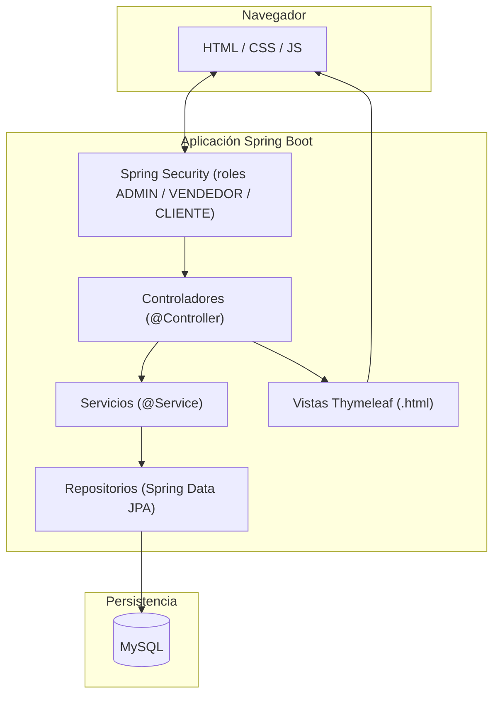
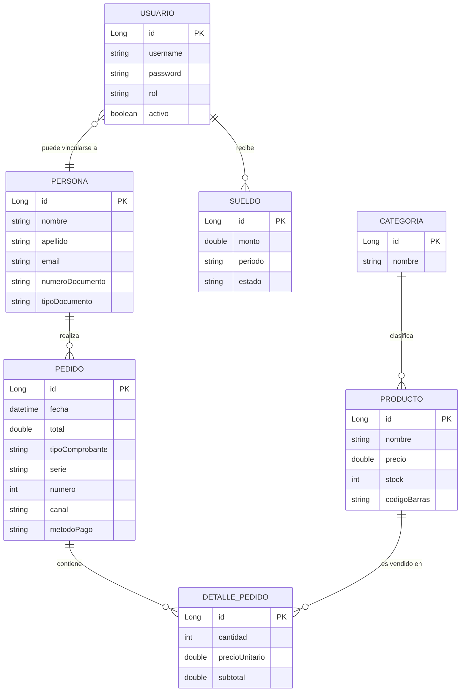

# TiendaMas — Sistema de Gestión de Ventas e Inventario

## Informe Técnico Final

| | |
|---|---|
| **Institución** | [COMPLETAR: nombre de la institución] |
| **Carrera / Tecnicatura** | [COMPLETAR: nombre de la carrera] |
| **Materia / Espacio curricular** | [COMPLETAR: nombre de la materia, si aplica] |
| **Autor/a(es)** | [COMPLETAR: nombre y apellido del/de la estudiante] |
| **Docente / Tutor/a** | [COMPLETAR: nombre del docente o tutor de proyecto] |
| **Legajo** | [COMPLETAR] |
| **Fecha de entrega** | [COMPLETAR: ej. 21/07/2026] |
| **Repositorio** | [COMPLETAR: URL del repositorio Git, si se publica] |
| **Versión del sistema** | 0.0.1-SNAPSHOT |

> **Nota para el/la autor/a:** este documento fue generado a partir de un relevamiento automático del código fuente del proyecto (paquetes, entidades, controladores, seguridad y configuración). Los campos entre corchetes `[COMPLETAR: ...]` son datos que solo vos podés completar (institucionales, capturas de pantalla, cronograma real, bibliografía consultada, etc.). Revisá cada sección antes de entregar: el objetivo es que el informe describa fielmente tu proceso de trabajo, no solo el resultado técnico.

---

## Índice

1. [Introducción](#1-introducción)
2. [Objetivos](#2-objetivos)
3. [Alcance y limitaciones](#3-alcance-y-limitaciones)
4. [Marco teórico y tecnologías utilizadas](#4-marco-teórico-y-tecnologías-utilizadas)
5. [Metodología de trabajo](#5-metodología-de-trabajo)
6. [Relevamiento y análisis de requerimientos](#6-relevamiento-y-análisis-de-requerimientos)
7. [Diseño del sistema](#7-diseño-del-sistema)
8. [Implementación](#8-implementación)
9. [Seguridad](#9-seguridad)
10. [Pruebas](#10-pruebas)
11. [Manual de instalación y despliegue](#11-manual-de-instalación-y-despliegue)
12. [Manual de usuario](#12-manual-de-usuario)
13. [Resultados obtenidos](#13-resultados-obtenidos)
14. [Conclusiones](#14-conclusiones)
15. [Trabajo futuro](#15-trabajo-futuro)
16. [Bibliografía y referencias](#16-bibliografía-y-referencias)
17. [Anexos](#17-anexos)

---

## 1. Introducción

TiendaMas es un sistema web de gestión de ventas e inventario, pensado para pequeños y medianos comercios que necesitan administrar en un mismo lugar su catálogo de productos, sus clientes, sus ventas presenciales (punto de venta) y sus ventas en línea (tienda virtual), además de llevar un control básico de gastos, sueldos del personal y reportes gerenciales.

El proyecto surge de la necesidad habitual de este tipo de comercios de reemplazar procesos manuales o dispersos en planillas (registro de ventas, control de stock, seguimiento de gastos) por una herramienta única, con distintos niveles de acceso según el rol de cada usuario (administrador, vendedor, cliente).

El desarrollo se llevó a cabo como proyecto integrador de carrera, en un ciclo corto e intensivo: la totalidad de las funcionalidades descriptas en este informe fueron implementadas y versionadas en el lapso de tres días (19 al 21 de julio de 2026), trabajando de forma iterativa módulo por módulo. Esta forma de trabajo condicionó varias decisiones técnicas —por ejemplo, la elección de un monolito con renderizado del lado del servidor en lugar de una arquitectura desacoplada— que se explican con más detalle en la sección 4.3.

Este informe documenta el análisis, diseño, implementación y pruebas del sistema, así como las decisiones técnicas tomadas durante su desarrollo y las conclusiones obtenidas al finalizar el proyecto.

---

## 2. Objetivos

### 2.1 Objetivo general

Desarrollar un sistema web integral que permita a un comercio gestionar su inventario, sus ventas (presenciales y en línea) y su información administrativa básica (gastos y sueldos), a través de una única plataforma con control de acceso diferenciado por roles.

### 2.2 Objetivos específicos

- Diseñar un modelo de datos que represente correctamente las entidades del dominio de un comercio: personas, productos, categorías, pedidos/ventas, gastos y sueldos.
- Implementar un módulo de **punto de venta (POS)** para la atención presencial, con carrito de venta, búsqueda de productos por código de barras y emisión de comprobante.
- Implementar una **tienda en línea** de autoservicio para que los clientes puedan explorar el catálogo, armar su carrito y generar sus propios pedidos.
- Implementar un **panel administrativo** con ABM (alta, baja, modificación) de personas, productos, categorías, gastos y sueldos.
- Incorporar un módulo de **reportes** que resuma ventas, productos más vendidos, ventas por canal/método de pago y recomendaciones de reabastecimiento según velocidad de venta.
- Aplicar un esquema de **autenticación y autorización basado en roles** (administrador, vendedor, cliente) que restrinja el acceso a cada módulo según corresponda.
- Aplicar una arquitectura en capas (controlador–servicio–repositorio) que favorezca la mantenibilidad y la separación de responsabilidades.

---

## 3. Alcance y limitaciones

### 3.1 Alcance

El sistema cubre, para un único comercio (mono-tenant):

- Gestión de personas (clientes/empleados) con datos de contacto y documento (DNI/RUC), incluyendo el tipo de comprobante sugerido (boleta o factura).
- Catálogo de productos organizado por categorías, con stock, precio, marca, unidad de medida, código de barras e imagen.
- Venta presencial por punto de venta (POS), con numeración correlativa de comprobantes por tipo (boleta/factura).
- Tienda en línea pública, con carrito de compras, checkout y seguimiento de "mis pedidos" para clientes registrados.
- Registro de gastos del negocio (fijos/variables, recurrentes o no) y de sueldos del personal (con estado pendiente/pagado).
- Reportes agregados: ventas totales, ventas por canal, por método de pago, por categoría, productos más vendidos y resumen mensual (ventas vs. gastos vs. sueldos).
- Gestión de usuarios y perfil (cambio de datos personales y de contraseña).

### 3.2 Limitaciones (fuera de alcance)

A partir del estado actual del código, quedan deliberadamente fuera de alcance de esta primera versión:

- Integración con medios de pago reales (pasarelas de pago) — el método de pago se registra pero no se procesa contra ningún proveedor externo.
- Facturación electrónica homologada ante un ente fiscal real (el sistema modela boleta/factura de forma interna, sin integración con AFIP/SUNAT u organismo equivalente).
- Multi-sucursal / multi-comercio (el sistema está diseñado para una sola tienda).
- Aplicación móvil nativa (la interfaz es web responsiva).
- Notificaciones por correo electrónico o SMS.

---

## 4. Marco teórico y tecnologías utilizadas

### 4.1 Arquitectura de referencia

El sistema sigue el patrón **MVC (Modelo–Vista–Controlador)** en su variante de aplicación web server-side rendering, complementado con una arquitectura en capas típica de aplicaciones Spring:

```
Vista (Thymeleaf)  →  Controlador (@Controller)  →  Servicio (@Service)  →  Repositorio (@Repository / Spring Data JPA)  →  Base de datos
```

### 4.2 Stack tecnológico

| Categoría | Tecnología | Uso en el proyecto |
|---|---|---|
| Lenguaje | Java 17 | Lenguaje principal del backend |
| Framework | Spring Boot 4.0.6 | Framework de aplicación (autoconfiguración, servidor embebido) |
| Web MVC | Spring Web (Spring MVC) | Controladores y enrutamiento HTTP |
| Vistas | Thymeleaf | Motor de plantillas server-side para el renderizado HTML |
| Persistencia | Spring Data JPA + Hibernate | Mapeo objeto-relacional (ORM) |
| Base de datos (producción) | MySQL | Persistencia relacional |
| Base de datos (soporte) | H2 | Base en memoria disponible para pruebas/desarrollo |
| Seguridad | Spring Security | Autenticación por formulario y autorización basada en roles |
| Cifrado de contraseñas | BCrypt (`BCryptPasswordEncoder`) | Hash de contraseñas de usuario |
| Build / gestión de dependencias | Apache Maven (`pom.xml`, `mvnw`) | Compilación, empaquetado y ejecución |
| Frontend | HTML5, CSS propio (`estilos.css`), JavaScript (`main.js`) | Estilos e interactividad del lado del cliente |
| Control de versiones | Git | Historial de cambios y colaboración |

### 4.3 Justificación de la elección tecnológica

Se optó por **Spring Boot** frente a alternativas como Node/Express, Django o .NET principalmente por la madurez y la integración nativa entre sus módulos: Spring Security, Spring Data JPA y Thymeleaf se configuran y combinan con muy poco código de "pegamento", lo cual fue determinante dado el tiempo acotado de desarrollo (ver sección 5). Un stack con más piezas independientes (por ejemplo, una API REST separada más autenticación por tokens más un framework de frontend distinto) hubiera implicado resolver problemas de integración adicionales sin aportar valor funcional al alcance definido.

Se optó por **Thymeleaf con renderizado del lado del servidor**, en lugar de una arquitectura desacoplada tipo SPA (React/Angular + API REST), por tres razones concretas:

1. **Superficie de trabajo menor:** un único proyecto Maven, un único proceso desplegado y un único lenguaje (Java) para toda la lógica de negocio, sin necesidad de mantener un contrato de API versionado entre frontend y backend.
2. **Seguridad "gratis":** Spring Security se integra directamente con los formularios Thymeleaf (incluida la protección CSRF, verificada en la sección 9), sin necesidad de implementar autenticación basada en tokens (JWT) ni gestionar su renovación en el cliente.
3. **Alcance del proyecto:** al tratarse de una aplicación de gestión interna (panel administrativo, POS) más una tienda de autoservicio simple, no había un requisito real de interfaz altamente interactiva que justificara el costo adicional de una SPA.

La contrapartida asumida conscientemente es una interfaz menos "fluida" que una SPA (cada acción implica una recarga o redirección de página), aceptable para el tipo de uso interno/administrativo que tiene la mayor parte del sistema.

---

## 5. Metodología de trabajo

El proyecto se desarrolló bajo un esquema de **desarrollo iterativo e incremental, en un ciclo corto e intensivo**, sin sprints formales ni ceremonias de un framework ágil determinado: cada módulo funcional se llevó de punta a punta (modelo de datos → repositorio → servicio → controlador → vista) antes de pasar al siguiente, lo que permitió tener en todo momento una aplicación ejecutable.

- **Enfoque:** desarrollo iterativo por módulo completo (personas y catálogo → seguridad y autenticación → punto de venta → tienda en línea → gastos, sueldos y reportes → ajustes de interfaz y experiencia de usuario).
- **Control de versiones:** Git, con un historial de 9 commits entre el 19 y el 21 de julio de 2026 (`git log` del repositorio). Los mensajes de commit iniciales priorizaron la velocidad de iteración por sobre la trazabilidad detallada (p. ej. "versión 1.2", "version f"); de cara a una posible continuidad del proyecto, se recomienda adoptar mensajes de commit descriptivos por funcionalidad.
- **Organización de tareas:** desarrollo individual, sin tablero de gestión formal; el orden de trabajo se guio por la dependencia natural entre módulos (no tiene sentido el punto de venta sin catálogo, ni los reportes sin ventas registradas).
- **Duración real del proyecto:** 3 días (19/07/2026 a 21/07/2026), lo cual explica y justifica varias decisiones de la sección 4.3 (elegir el stack con menor fricción de integración posible).

### 5.1 Cronograma real

A diferencia de un cronograma planificado en etapas separadas por semanas, el desarrollo se concentró en tres jornadas de trabajo continuo. La siguiente tabla refleja el orden real en que se fueron incorporando las funcionalidades, reconstruido a partir del historial de commits:

| Jornada | Fecha | Trabajo realizado |
|---|---|---|
| Día 1 | 19/07/2026 | Estructura base del proyecto (Spring Boot, seguridad, JPA), modelo de datos inicial y primeras funcionalidades de gestión (personas, catálogo). |
| Día 2 | 20/07/2026 | Iteración y consolidación de funcionalidades: punto de venta, tienda en línea, gastos, sueldos y reportes. |
| Día 3 | 21/07/2026 | Ajustes finales, corrección de la configuración de ejecución (ver sección 11), y rediseño de experiencia de usuario: navegación del panel administrativo, pie de página de la tienda y paleta de colores unificada (ver sección 8.6). |

[COMPLETAR si corresponde: si además hiciste un relevamiento, diseño o aprendizaje previo de las tecnologías *antes* de empezar a commitear código, mencionalo acá — el historial de Git solo captura desde el primer commit, no el trabajo de preparación previo.]

---

## 6. Relevamiento y análisis de requerimientos

### 6.1 Requerimientos funcionales

| Nº | Requerimiento | Módulo |
|---|---|---|
| RF-01 | El sistema debe permitir autenticar usuarios con usuario y contraseña, redirigiendo según su rol. | Seguridad |
| RF-02 | El sistema debe permitir el autorregistro de nuevos clientes. | Registro |
| RF-03 | El sistema debe permitir el ABM de personas (clientes). | Personas |
| RF-04 | El sistema debe permitir el ABM de categorías y productos, incluyendo stock, precio, código de barras e imagen. | Catálogo |
| RF-05 | El sistema debe permitir registrar una venta presencial desde un punto de venta (POS), buscando productos por código de barras o selección manual. | POS |
| RF-06 | El sistema debe emitir un comprobante (boleta o factura) numerado correlativamente según el tipo de documento del cliente. | POS / Pedidos |
| RF-07 | El sistema debe permitir a un cliente registrado navegar el catálogo público, agregar productos a un carrito y finalizar la compra (checkout) sin intervención de un vendedor. | Tienda en línea |
| RF-08 | El sistema debe permitir a un cliente consultar el historial de sus propios pedidos. | Tienda en línea |
| RF-09 | El sistema debe permitir registrar y administrar gastos del negocio, incluyendo gastos recurrentes. | Gastos |
| RF-10 | El sistema debe permitir registrar y administrar el pago de sueldos al personal, con estado pendiente/pagado. | Sueldos |
| RF-11 | El sistema debe generar reportes de ventas totales, ventas por canal, por método de pago, por categoría y productos más vendidos. | Reportes |
| RF-12 | El sistema debe sugerir reabastecimiento de productos según su velocidad de venta y stock actual. | Reportes |
| RF-13 | El sistema debe permitir a cada usuario editar sus datos personales y cambiar su contraseña. | Perfil |

### 6.2 Requerimientos no funcionales

| Nº | Requerimiento | Justificación |
|---|---|---|
| RNF-01 | El acceso a cada módulo debe restringirse según el rol del usuario autenticado (ADMIN, VENDEDOR, CLIENTE). | Confidencialidad e integridad de la información administrativa. |
| RNF-02 | Las contraseñas deben almacenarse cifradas (nunca en texto plano). | Seguridad de credenciales. |
| RNF-03 | La interfaz debe ser accesible desde un navegador web estándar, sin instalación de software adicional. | Facilidad de adopción. |
| RNF-04 | El sistema debe ejecutarse sobre una base de datos relacional persistente (MySQL) en producción. | Integridad y durabilidad de los datos. |
| RNF-05 | El sistema debe permitir cargar datos de demostración de forma automática al iniciar, sin sobrescribir datos ya existentes. | Facilitar pruebas y demostraciones (ver `DataSeeder`, idempotente). |
| RNF-06 | El tamaño máximo de archivos subidos (imágenes de producto) debe estar acotado. | Se limita a 5 MB por archivo (`application.yml`). |

### 6.3 Actores del sistema

| Actor | Descripción | Accesos principales |
|---|---|---|
| **Administrador** | Dueño/a o encargado/a del comercio. | Panel completo: personas, catálogo, gastos, sueldos, reportes, pedidos, y también POS. |
| **Vendedor** | Empleado que atiende ventas presenciales. | Punto de venta (POS) y sus propias ventas. |
| **Cliente** | Usuario final que compra en la tienda en línea o es atendido en el mostrador. | Catálogo público, carrito, checkout, perfil y sus propios pedidos. |

---

## 7. Diseño del sistema

### 7.1 Arquitectura general

La aplicación es un **monolito modular** desplegado como un único artefacto Spring Boot (servidor embebido Tomcat), organizado en capas horizontales y en paquetes verticales por responsabilidad técnica:

```
com.tiendamas
├── config/       → Configuración de seguridad, MVC y atributos globales de vista
├── controller/   → Controladores web (capa de presentación / enrutamiento)
├── dto/          → Objetos de transferencia de datos (formularios, resúmenes)
├── entity/       → Entidades JPA (modelo de dominio persistente) y enumerados
├── repository/   → Interfaces Spring Data JPA (acceso a datos)
├── service/      → Interfaces de servicio (lógica de negocio)
│   └── impl/     → Implementaciones de los servicios
├── util/         → Utilidades (siembra de datos, almacenamiento de imágenes)
└── web/          → Objetos de sesión web (carrito de compras)
```

Este esquema separa claramente:

- **Presentación** (`controller` + `templates` Thymeleaf): recibe peticiones HTTP, arma el modelo de vista y decide qué plantilla renderizar.
- **Negocio** (`service`): concentra las reglas de negocio (por ejemplo, `PedidoServiceImpl.crearVenta()` calcula totales, determina el tipo de comprobante según el cliente y asigna numeración correlativa).
- **Persistencia** (`repository` + `entity`): abstrae el acceso a la base de datos mediante Spring Data JPA.

### 7.2 Diagrama de arquitectura (capas)



### 7.3 Modelo de datos

#### 7.3.1 Entidades principales

| Entidad | Descripción | Relaciones principales |
|---|---|---|
| `Persona` | Cliente del comercio. Incluye tipo/número de documento (DNI o RUC) y determina el tipo de comprobante sugerido. | 1 a N con `Pedido` |
| `Usuario` | Cuenta de acceso al sistema (login), con rol y, opcionalmente, vínculo a una `Persona`. | N a 1 con `Persona` |
| `Categoria` | Clasificación de productos. | 1 a N con `Producto` |
| `Producto` | Artículo del catálogo: nombre, precio, stock, código de barras, marca, unidad de medida, imagen. | N a 1 con `Categoria`; 1 a N con `DetallePedido` |
| `Pedido` | Venta/pedido, presencial u online. Incluye canal, método de pago, tipo y numeración de comprobante. | N a 1 con `Persona`; 1 a N con `DetallePedido` |
| `DetallePedido` | Línea de un pedido (producto, cantidad, precio unitario, subtotal). | N a 1 con `Pedido` y con `Producto` |
| `SerieCorrelativo` | Lleva el último número emitido por tipo de comprobante (boleta/factura), para numeración correlativa. | Clave = `TipoComprobante` |
| `Gasto` | Egreso del negocio (concepto, categoría, monto, fecha, si es recurrente y con qué frecuencia). | — |
| `Sueldo` | Pago de sueldo a un `Usuario` (monto, período, fecha de pago, estado). | N a 1 con `Usuario` |

#### 7.3.2 Enumerados de dominio

| Enumerado | Valores | Uso |
|---|---|---|
| `RolUsuario` | `ADMIN`, `VENDEDOR`, `CLIENTE` | Autorización por rol |
| `TipoComprobante` | `BOLETA` (serie B001), `FACTURA` (serie F001) | Numeración y tipo de comprobante emitido |
| `TipoDocumento` | DNI, RUC (u otro definido en el proyecto) | Determina el tipo de comprobante sugerido |
| `CanalVenta` | `TIENDA_FISICA`, `ONLINE` | Distingue ventas por POS de ventas por la tienda en línea |
| `MetodoPago` | Efectivo, tarjeta, etc. (según definición del proyecto) | Método utilizado en el pago |
| `Genero` | Según definición del proyecto | Dato de la persona |
| `CategoriaGasto`, `FrecuenciaGasto` | Según definición del proyecto | Clasifican los gastos |
| `EstadoSueldo` | `PENDIENTE`, `PAGADO` | Estado del pago de sueldo |

#### 7.3.3 Diagrama entidad-relación (simplificado)



> **Nota:** para incluir este diagrama en Word/PDF, podés renderizarlo con la extensión de Mermaid de tu editor, con [mermaid.live](https://mermaid.live), o pedirme que te genere una versión en imagen para pegarla directamente en el documento.

### 7.4 Casos de uso principales

[COMPLETAR con el diagrama de casos de uso (UML) si la cátedra lo exige — herramientas como draw.io, Lucidchart o PlantUML son habituales]. A partir de los controladores relevados, los casos de uso centrales son:

- **Administrador:** gestionar personas, gestionar catálogo (categorías/productos), gestionar gastos, gestionar sueldos, consultar reportes, gestionar pedidos, operar el punto de venta.
- **Vendedor:** operar el punto de venta (armar carrito, cobrar, emitir comprobante), consultar sus propias ventas.
- **Cliente:** registrarse, explorar catálogo, armar carrito, finalizar compra (checkout), consultar sus pedidos, editar su perfil.

---

## 8. Implementación

### 8.1 Módulos funcionales y endpoints

| Módulo | Controlador | Ruta base | Acceso |
|---|---|---|---|
| Autenticación / Home | `HomeController` | `/`, `/login` | Público |
| Registro de clientes | `RegistroController` | `/registro` | Público |
| Perfil de usuario | `PerfilController` | `/perfil` | Usuario autenticado |
| Personas (clientes) | `PersonaController` | `/personas` | ADMIN |
| Categorías | `CategoriaController` | `/categorias` | ADMIN |
| Productos | `ProductoController` | `/productos` | ADMIN |
| Punto de venta | `PosController` | `/pos` | VENDEDOR, ADMIN |
| Pedidos (panel admin) | `PedidoController` | `/pedidos` | ADMIN (consulta de comprobante: cualquier autenticado, validando propiedad) |
| Tienda en línea | `TiendaController` | `/tienda` | Público (catálogo/carrito); CLIENTE (checkout, pedidos, perfil de tienda) |
| Gastos | `GastoController` | `/gastos` | ADMIN |
| Sueldos | `SueldoController` | `/sueldos` | ADMIN |
| Reportes | `ReporteController` | `/reportes` | ADMIN |

### 8.2 Flujo destacado: venta por punto de venta (POS)

1. El vendedor busca un producto por código de barras (`POST /pos/carrito/agregar-por-codigo`) o lo selecciona manualmente (`POST /pos/carrito/agregar`).
2. El producto se agrega a un carrito de sesión (bean `Carrito`, con alcance de sesión web), pudiendo ajustar cantidades (`POST /pos/carrito/cantidad`) o quitar ítems (`POST /pos/carrito/quitar/{productoId}`).
3. Al finalizar, el vendedor confirma la venta (`POST /pos/checkout`) indicando cliente y método de pago.
4. `PedidoServiceImpl.crearVenta(...)`:
   - valida que el cliente exista;
   - determina el tipo de comprobante (boleta o factura) según el tipo de documento del cliente (`Persona.getTipoComprobanteSugerido()`);
   - obtiene el siguiente número correlativo para ese tipo de comprobante (`SerieCorrelativoService`);
   - calcula el subtotal de cada línea y el total del pedido;
   - persiste el `Pedido` junto con sus `DetallePedido` (cascada `ALL`, `orphanRemoval`).
5. El carrito se vacía y se redirige al comprobante del pedido recién creado.

Este mismo flujo (`crearVenta`) es reutilizado por el checkout de la **tienda en línea**, cambiando únicamente el canal (`CanalVenta.ONLINE`) y sin vendedor asociado — lo que evita duplicar la lógica de negocio entre ambos canales de venta.

### 8.3 Módulo de reportes

`ReporteController` agrega, sobre la colección de pedidos, gastos y sueldos:

- Ventas totales, cantidad de pedidos, clientes y productos.
- Ranking de productos más vendidos (`PedidoService.obtenerMasVendidos`).
- Ventas agrupadas por categoría, canal y método de pago.
- **Recomendaciones de reabastecimiento**: para cada producto, calcula la velocidad de venta de los últimos 30 días y estima los días de stock restantes; clasifica el producto como `URGENTE` (stock ≤ 5 unidades o ≤ 7 días de stock restante) o `MODERADO` (≤ 14 días restantes).
- **Resumen mensual** (últimos 6 meses) comparando ventas, gastos y sueldos por mes, para dar una vista rápida de rentabilidad.

### 8.4 Datos de demostración

`DataSeeder` (que implementa `CommandLineRunner`) siembra datos de ejemplo al iniciar la aplicación (categorías, productos, personas, series correlativas, gastos, sueldos y los usuarios iniciales detallados en la sección 11.5). Cada bloque de siembra es **idempotente**: verifica si ya existen datos de ese tipo antes de insertarlos, para no duplicar información ni afectar una base de datos real ya en uso.

### 8.5 Persistencia y configuración

- `spring.jpa.hibernate.ddl-auto=update`: Hibernate actualiza el esquema automáticamente a partir de las entidades. Es una opción adecuada para el desarrollo ágil de este proyecto, pero no para un uso en producción real, donde se recomienda migrar a herramientas de migración versionada del esquema (Flyway o Liquibase) — ver sección 15.
- Conexión configurada contra MySQL en `localhost:3306/TiendaMas` (`application.yml`).
- H2 disponible como dependencia en memoria, útil para pruebas rápidas sin depender de una instancia de MySQL.
- Carga de imágenes de producto limitada a 5 MB (`spring.servlet.multipart`), gestionada por `ImagenStorage`.

### 8.6 Interfaz: navegación, pie de página y paleta de colores

Sobre el final del desarrollo se revisó la experiencia de usuario del sistema con tres cambios concretos:

- **Navegación del panel administrativo:** se reemplazó el menú lateral (sidebar) por una **barra de navegación superior fija**, agrupando los módulos afines en desplegables (Semantic UI `dropdown`) para no saturar la barra: *Catálogo* (Productos, Categorías), *Ventas* (Pedidos, Reportes) y *Finanzas* (Gastos, Sueldos), más *Clientes* como enlace directo y un menú de cuenta a la derecha (perfil, acceso al punto de venta y cierre de sesión). En pantallas angostas, la barra colapsa a un menú desplegable con botón de hamburguesa, siguiendo el mismo patrón ya usado en la tienda en línea.
- **Pie de página de la tienda en línea:** se amplió de una línea de copyright a un pie de página de cuatro columnas (marca y medios de pago, enlaces de compra, ayuda y contacto), siguiendo el patrón habitual de las tiendas en línea de comercios más grandes.
- **Paleta de colores:** se unificó la paleta visual de todo el sistema (panel administrativo, punto de venta, tienda en línea, comprobantes y login) a un esquema de grises neutros fríos (*slate*) con un único color de acento índigo para acciones y estados activos, reemplazando la combinación previa de azul marino, crema, beige y un acento turquesa exclusivo del menú lateral. Al implementarse mediante variables CSS (`:root` en `estilos.css`), el cambio de paleta se propaga automáticamente a botones, tablas, tarjetas y formularios sin modificar cada plantilla individualmente.

Estos tres cambios se validaron funcionalmente arrancando la aplicación y verificando por HTTP (sin errores de renderizado de Thymeleaf) el panel administrativo completo y la tienda en línea; el detalle de esa verificación está en la sección 10.

---

## 9. Seguridad

La seguridad se implementa con **Spring Security**, configurada en `SecurityConfig`:

- **Autenticación:** formulario propio (`/login`), con `UsuarioDetailsServiceImpl` cargando el usuario desde la base de datos y `BCryptPasswordEncoder` para verificar la contraseña sin almacenarla en texto plano.
- **Redirección post-login por rol:** `RoleBasedAuthSuccessHandler` redirige a cada usuario a la pantalla inicial correspondiente a su rol (por ejemplo, un vendedor va al POS, un cliente a la tienda, un administrador al panel).
- **Autorización por rutas**, de más a menos específica:

| Ruta | Roles permitidos |
|---|---|
| `/css/**`, `/js/**`, `/login`, `/registro` | Público |
| `/tienda/checkout/**`, `/tienda/pedidos/**`, `/tienda/perfil/**` | CLIENTE |
| `/tienda/**` (catálogo y carrito) | Público |
| `/pos/**` | VENDEDOR, ADMIN |
| `/personas/**`, `/categorias/**`, `/productos/**`, `/reportes/**`, `/gastos/**`, `/sueldos/**` | ADMIN |
| `/pedidos`, `/pedidos/nuevo`, `/pedidos/*/eliminar` | ADMIN |
| `/pedidos/**` (ver comprobante puntual) | Cualquier autenticado (el controlador valida además que el pedido pertenezca al usuario o que este tenga permiso administrativo) |
| Cualquier otra ruta | Autenticado |

- **Cierre de sesión:** `/logout`, con redirección a `/login?logout`.

- **Protección CSRF:** activa por defecto (no se deshabilita en `SecurityConfig`). Se verificó de forma concreta que Spring inyecta automáticamente un campo oculto `_csrf` en el formulario de login (`login.html`) a través de la integración de Thymeleaf con Spring Security, y que una petición `POST /login` sin ese token es rechazada (redirige nuevamente a `/login` sin autenticar). Todos los formularios de la aplicación que usan `th:action` quedan protegidos de la misma manera sin código adicional.
- **Contraseñas:** se almacenan con `BCryptPasswordEncoder` (hash con costo adaptativo), nunca en texto plano.

[COMPLETAR si corresponde: reglas de validación de datos de entrada (longitud/formato de contraseña en el registro, unicidad de email/usuario, etc.) si agregaste alguna más allá de las restricciones de la base de datos.]

---

## 10. Pruebas

El proyecto incluye, al momento de este relevamiento, una clase de prueba base generada por Spring Initializr (`TiendaMasApplicationTests`), que verifica que el contexto de la aplicación cargue correctamente. **No hay pruebas unitarias ni de integración automatizadas** sobre la lógica de negocio (servicios) ni sobre los controladores — es la limitación más importante detectada en este relevamiento (ver también sección 15).

Como compensación parcial, se realizó una **verificación manual funcional por HTTP** (con `curl`, simulando un navegador) sobre la aplicación en ejecución, enfocada en confirmar que el sistema arranca correctamente y que la restricción de acceso por rol (RNF-01) se cumple. Los resultados fueron los siguientes:

### 10.1 Casos de prueba ejecutados y resultado obtenido

| Caso | Pasos | Resultado esperado | Resultado obtenido |
|---|---|---|---|
| Arranque de la aplicación | Compilar (`mvn clean compile`) y ejecutar (`mvn spring-boot:run`) | Arranca sin errores y conecta a MySQL | **OK** — compiló 71 archivos fuente sin errores y conectó a MySQL correctamente. |
| Login con credenciales válidas (ADMIN) | POST `/login` con `admin` / `admin123` y token CSRF válido | Redirige autenticado (302) al panel | **OK** — redirigió a `/personas` con sesión autenticada. |
| Login sin token CSRF | POST `/login` sin el campo `_csrf` | Se rechaza, no autentica | **OK** — redirigió nuevamente a `/login` sin crear sesión autenticada. |
| Renderizado del panel administrativo | Como ADMIN, solicitar `/productos`, `/categorias`, `/pedidos`, `/reportes`, `/gastos`, `/sueldos`, `/personas`, `/perfil`, `/pos` | Todas responden 200, sin errores de Thymeleaf | **OK** — las 9 rutas devolvieron 200, sin trazas de error ("Whitelabel"/excepción) en el HTML. |
| Renderizado de la tienda en línea | Solicitar `/tienda` (pie de página nuevo) | Responde 200, con el pie de página de 4 columnas | **OK** — 200, con las secciones `tienda-footer-main` y `tienda-footer-bottom` presentes. |
| Acceso de CLIENTE a `/productos` y `/pos` | Loguearse como `cliente1` e intentar acceder | Acceso denegado (403) | **OK** — ambas rutas devolvieron 403. |
| Acceso de CLIENTE a `/tienda` | Loguearse como `cliente1` y acceder a `/tienda` | Acceso permitido (200) | **OK**. |
| Acceso de VENDEDOR a `/pos` | Loguearse como `vendedor1` y acceder a `/pos` | Acceso permitido (200) | **OK**. |
| Acceso de VENDEDOR a `/productos` y `/reportes` | Loguearse como `vendedor1` e intentar acceder | Acceso denegado (403), reservado a ADMIN | **OK** — ambas rutas devolvieron 403. |
| Acceso anónimo a `/pos` y `/productos` | Solicitar las rutas sin sesión iniciada | Redirige a `/login` (302) | **OK**. |

### 10.2 Pendiente de verificación manual (requiere navegador)

Las pruebas anteriores validan que el sistema responde y que la seguridad por rol funciona a nivel HTTP, pero no reemplazan una prueba visual/funcional completa en el navegador. Quedan pendientes, idealmente con capturas de pantalla para el informe (sección 13):

| Caso | Pasos | Resultado esperado | Resultado obtenido |
|---|---|---|---|
| Venta completa por POS | Agregar productos al carrito, elegir cliente y método de pago, confirmar | Se genera el pedido con comprobante numerado y el carrito se vacía | [COMPLETAR] |
| Checkout completo en la tienda en línea | Armar carrito como cliente y finalizar compra | Se genera el pedido en el canal ONLINE y aparece en "Mis pedidos" | [COMPLETAR] |
| Alta de producto con imagen | Cargar producto nuevo con código de barras único e imagen | Producto visible en catálogo, POS y tienda | [COMPLETAR] |
| Navegación por los desplegables del nuevo navbar admin | Abrir Catálogo, Ventas y Finanzas desde el navbar superior | Cada desplegable muestra sus enlaces y navega correctamente | [COMPLETAR] |
| Navbar admin y footer de tienda en móvil | Reducir el ancho de la ventana o probar en un celular | El navbar colapsa a menú hamburguesa; el pie de página se apila en una columna | [COMPLETAR] |

Si se incorporan pruebas automatizadas antes de la entrega, se recomienda documentar acá: framework usado (JUnit 5 + Mockito, ya disponibles vía `spring-boot-starter-test`), cobertura alcanzada y casos cubiertos — priorizando `PedidoServiceImpl.crearVenta`, que concentra la regla de negocio más crítica del sistema.

---

## 11. Manual de instalación y despliegue

### 11.1 Requisitos previos

- JDK 17 o superior.
- MySQL 8.x en ejecución (o ajustar `application.yml` para usar H2 en su lugar).
- Maven (o usar el wrapper incluido `mvnw` / `mvnw.cmd`, que no requiere instalación previa).

### 11.2 Configuración de la base de datos

Crear la base `TiendaMas` en MySQL (o dejar que se cree según la configuración del driver) y ajustar credenciales en `src/main/resources/application.yml`:

```yaml
spring:
  datasource:
    url: jdbc:mysql://localhost:3306/TiendaMas?useSSL=false&serverTimezone=UTC&allowPublicKeyRetrieval=true
    username: [COMPLETAR]
    password: [COMPLETAR]
```

> **Importante (seguridad):** las credenciales actuales de `application.yml` están fijas en el archivo (usuario `root` con contraseña en texto plano). Para la entrega final se recomienda **no dejar credenciales reales en el repositorio**: usar variables de entorno o un `application-local.yml` fuera del control de versiones, y documentarlo así en este manual.

### 11.3 Ejecución en desarrollo

```bash
# Windows
mvnw.cmd spring-boot:run

# Linux/Mac
./mvnw spring-boot:run
```

La aplicación queda disponible en `http://localhost:9097` (puerto configurado en `application.yml`).

### 11.4 Compilación de un artefacto ejecutable

```bash
mvnw.cmd clean package
java -jar target/tiendaMas-0.0.1-SNAPSHOT.jar
```

### 11.5 Primer inicio

Al arrancar por primera vez, `DataSeeder` carga datos de demostración (categorías, productos, personas, series correlativas de comprobantes, gastos, sueldos y los siguientes usuarios de prueba, uno por cada rol del sistema):

| Usuario | Contraseña | Rol |
|---|---|---|
| `admin` | `admin123` | ADMIN |
| `vendedor1` | `vendedor123` | VENDEDOR |
| `vendedor2` | `vendedor123` | VENDEDOR |
| `cliente1` | `cliente123` | CLIENTE |
| `cliente2` | `cliente123` | CLIENTE |

> Estas credenciales están definidas en `DataSeeder` y solo tienen sentido para un entorno de desarrollo/demostración. No deben usarse en un despliegue real sin cambiarlas.

---

## 12. Manual de usuario

[COMPLETAR esta sección con capturas de pantalla reales de la aplicación en funcionamiento — es habitual que se pida explícitamente en la evaluación final. A continuación se deja la estructura y el flujo esperado por rol.]

### 12.1 Cliente

1. Ingresar a la tienda en línea (`/tienda`) — accesible sin necesidad de iniciar sesión para navegar el catálogo.
2. Registrarse (`/registro`) o iniciar sesión (`/login`).
3. Explorar productos, ver el detalle de cada uno (`/tienda/productos/{id}`).
4. Agregar productos al carrito (`/tienda/carrito`), ajustar cantidades.
5. Finalizar la compra (`/tienda/checkout`) — requiere sesión de CLIENTE.
6. Consultar el historial de pedidos propios (`/tienda/pedidos`) y editar el perfil (`/tienda/perfil` o `/perfil`).

### 12.2 Vendedor

1. Iniciar sesión — el sistema redirige automáticamente al punto de venta.
2. Buscar productos por código de barras o seleccionarlos manualmente en `/pos`.
3. Ajustar cantidades en el carrito, elegir cliente y método de pago.
4. Confirmar la venta y visualizar/entregar el comprobante generado.
5. Consultar sus ventas realizadas en `/pos/ventas`.

### 12.3 Administrador

1. Iniciar sesión — acceso al panel administrativo completo.
2. Gestionar catálogo: categorías (`/categorias`) y productos (`/productos`).
3. Gestionar personas/clientes (`/personas`).
4. Consultar y administrar pedidos (`/pedidos`).
5. Registrar gastos (`/gastos`) y sueldos (`/sueldos`), incluyendo marcar sueldos como pagados.
6. Consultar reportes (`/reportes`): ventas, productos más vendidos, recomendaciones de reabastecimiento y resumen mensual.
7. Puede además operar el punto de venta como soporte a los vendedores.

---

## 13. Resultados obtenidos

Todos los objetivos específicos planteados en la sección 2.2 se implementaron y se verificaron en funcionamiento (arranque de la aplicación, conexión a la base de datos, renderizado de las 9 rutas del panel administrativo y de la tienda en línea, y cumplimiento de la restricción de acceso por rol), según el detalle de la sección 10.1. En particular:

- El modelo de datos representa correctamente el dominio (personas, productos, categorías, pedidos/detalle, gastos, sueldos), con relaciones y enumerados coherentes con las reglas del negocio (por ejemplo, el tipo de comprobante se deriva automáticamente del tipo de documento del cliente).
- El punto de venta y la tienda en línea comparten la misma lógica de creación de ventas (`PedidoServiceImpl.crearVenta`), diferenciándose solo por canal — lo que evita duplicar la regla de negocio más crítica del sistema.
- El módulo de reportes agrega ventas, productos más vendidos y una recomendación de reabastecimiento basada en velocidad de venta, cumpliendo el objetivo de dar visibilidad gerencial sobre el negocio.
- La seguridad por roles (ADMIN, VENDEDOR, CLIENTE) restringe correctamente el acceso a cada módulo, verificado de forma concreta y no solo por lectura del código de configuración.
- La experiencia de usuario se revisó y mejoró sobre el final del desarrollo: navegación superior en el panel administrativo, pie de página completo en la tienda y una paleta de colores unificada (sección 8.6).

**Limitación conocida más relevante:** la ausencia de pruebas automatizadas (sección 10) es el punto más débil del proyecto en términos de calidad de software, más allá de que la funcionalidad en sí esté completa y verificada manualmente.

[COMPLETAR con capturas de pantalla de las pantallas principales: login, tienda en línea, POS, panel de reportes, ABM de productos, etc. Se recomienda una imagen por módulo con un pie de foto breve explicando qué se ve — esto no se puede generar automáticamente desde este entorno de trabajo, sin acceso a un navegador con interfaz gráfica.]

---

## 14. Conclusiones

Los objetivos planteados en la sección 2 se cumplieron en su totalidad dentro del alcance definido: el sistema gestiona catálogo, ventas presenciales y en línea, información administrativa básica (gastos y sueldos) y reportes gerenciales, con control de acceso diferenciado por rol. La decisión arquitectónica de sostener un monolito Spring Boot con renderizado server-side (sección 4.3) resultó acertada para el marco de tiempo real del proyecto (tres días, sección 5): permitió llegar a una aplicación funcional de punta a punta sin invertir tiempo en la integración entre un frontend y un backend separados.

Si se retomara el proyecto, las dos decisiones que se revisarían primero son: (1) incorporar pruebas automatizadas desde el inicio en lugar de dejarlas para el final, ya que su ausencia es hoy la principal debilidad del proyecto (secciones 10 y 15); y (2) no versionar credenciales de base de datos en `application.yml` (sección 11.2), resolviéndolo desde el principio con variables de entorno.

La principal dificultad no fue de tipo algorítmico sino de **configuración de entorno**: al renombrar el paquete base del proyecto (de `episs.unaj.com.crudpersona` a `com.tiendamas`) quedó una configuración de ejecución de IntelliJ apuntando a una clase inexistente, lo que impedía levantar la aplicación desde el IDE aunque el código compilaba correctamente por línea de comandos — un recordatorio de que, tras un renombre de paquete, conviene revisar también los archivos de configuración del IDE (`.idea/`), no solo el código fuente.

[COMPLETAR: este espacio quedó redactado en base al relevamiento técnico del proyecto; se recomienda que sumes en primera persona tu propia valoración del proceso —qué fue lo que más te costó, qué es lo que más rescatás de haberlo hecho— ya que es la parte del informe que un jurado suele valorar como más genuina.]

---

## 15. Trabajo futuro

A partir de las limitaciones relevadas en la sección 3.2 y del estado actual del código, se identifican como posibles mejoras:

- Incorporar pruebas automatizadas (unitarias y de integración) para la capa de servicios, especialmente sobre `PedidoServiceImpl`.
- Migrar la gestión de esquema de `ddl-auto: update` a migraciones versionadas (Flyway/Liquibase) antes de un uso en producción real.
- Externalizar credenciales sensibles fuera del repositorio (variables de entorno / secrets).
- Integrar un medio de pago real para la tienda en línea.
- Soporte multi-sucursal.
- Notificaciones al cliente (correo/SMS) sobre el estado de su pedido.
- Completar la verificación visual en navegador de los cambios de interfaz descriptos en la sección 8.6 (navbar admin, pie de página, paleta de colores), incluyendo capturas de pantalla para este informe (ver sección 10.2).
- [COMPLETAR con otras ideas propias]

---

## 16. Bibliografía y referencias

Documentación oficial de las tecnologías utilizadas en el proyecto:

- Spring Boot Reference Documentation — https://docs.spring.io/spring-boot/
- Spring Security Reference — https://docs.spring.io/spring-security/reference/
- Spring Data JPA Reference — https://docs.spring.io/spring-data/jpa/reference/
- Thymeleaf Documentation — https://www.thymeleaf.org/documentation.html
- Semantic UI Documentation — https://semantic-ui.com/introduction/getting-started.html

[COMPLETAR: si además consultaste libros, cursos o artículos puntuales durante el desarrollo, agregalos acá con formato de cita (autor, título, año, editorial/URL).]

---

## 17. Anexos

- **Anexo A:** Diagrama entidad-relación completo. [COMPLETAR: imagen exportada]
- **Anexo B:** Diagrama de casos de uso. [COMPLETAR]
- **Anexo C:** Manual de usuario ilustrado (capturas). [COMPLETAR]
- **Anexo D:** Código fuente completo — disponible en el repositorio: [COMPLETAR: URL].
- **Anexo E:** Prompt/consigna original del trabajo práctico o proyecto integrador, si corresponde. [COMPLETAR]
